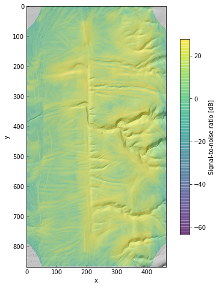
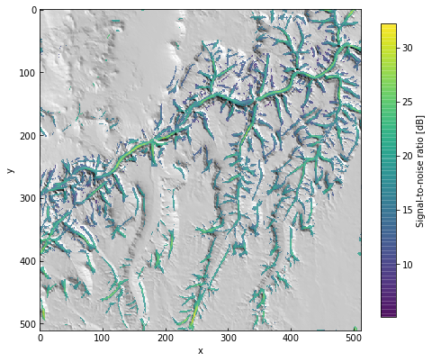

# scarplet


[](https://travis-ci.com/rmsare/scarplet)
[](https://scarplet.readthedocs.io/en/latest/?badge=latest)

A Python package for applying template matching techniques to digital elevation data, in
particular for detecting and measuring the maturity of fault scarps and other
landforms [[0, 1]](#references)

It was designed with two main goals:

* Allow contributors to define template functions for their problem area of interest
* Make it straightforward to apply these methods to large datasets by parallelizing/distrbuting computation using multiprocessing, [dask](https://dask.readthedocs.io), or other tools [[2]](#references)

The current version implements a variety of curvature-based landform templates,
and `match` and `compare` functions that can be used to distribute matching 
tasks and reduce results using multiple cores or a cluster. See the [quick start](https://scarplet.readthedocs.io/en/latest/quickstart.html) 
and [example notebooks](https://scarplet.readthedocs.io/en/latest/examples/scarps.html) for more.

## Getting started

### Installation

`scarplet` can be installed using `pip` or `conda`. It is developed for Python 3.4+.

```bash
conda install scarplet -c conda-forge
```

or

```bash
pip install scarplet
```

Or, to manually install the latest version from github: 

```bash
git clone https://github.com/rmsare/scarplet
cd scarplet
conda install --file=requirements.txt -c conda-forge
python setup.py develop
```

The main dependencies are numpy, scipy, numexpr, pyfftw (which requires LibFFTW3)
and rasterio/GDAL.

See the [installation page](https://scarplet.readthedocs.io/en/latest/installation.html)
for details on how to install GDAL and FFTW/pyFFTW, two dependencies that sometimes
cause issues.

## Examples

[Example notebooks](docs/source/examples/) and [sample data](docs/source/examples/data) can be found in the docs folder. Datasets can also be loaded within the package using the [datasets submodule](https://scarplet.readthedocs.io/en/latest/scarplet.datasets.html).

### Detecting fault scarps

This example uses a scarp template based on a diffusion model of scarp degradation
[[0]](#references) to identify scarp-like landforms along the San Andreas Fault near
Wallace Creek, CA.

```python
import numpy as np
import scarplet as sl
from scarplet.WindowedTemplate import Scarp

params = {'scale': 100,
          'age': 10,
          'ang_min': -10 * np.pi / 2,
          'ang_max': 10 * np.pi / 2
         }

data = sl.datasets.load_carrizo()
res = sl.match(data, Scarp, **params)

sl.plot_results(data, res)
```



### Extracting confined river channels

To illustrate template function flexibility, this example uses a Channel
template similar to the Ricker wavelet [[3]](#references) to extract part of a channel network.
This is example uses a moderate resolution SRTM data tile. In general, for 
high resolution data like lidar, there are more robust alternatives for 
channel network extraction or channel head identification [[4, 5]](#references).

```python
import numpy as np
import scarplet as sl
from scarplet.WindowedTemplate import Channel 

params = {'scale': 10,
          'age': 0.1,
          'ang_min': -np.pi / 2,
          'ang_max': np.pi / 2
         }

data = sl.datasets.load_grandcanyon()
res = sl.match(data, Channel, **params)

sl.plot_results(data, res)
```



There are also [example notebooks](https://scarplet.readthedocs.io/en/latest/index.html) and [an API reference](https://scarplet.readthedocs.io/en/latest/api.html) in the documentation.

## Documentation

Read the documentation for example use cases, an API reference, and more. They
are hosted at [scarplet.readthedocs.io](https://scarplet.readthedocs.io).

## Contributing

### Bug reports

Bug reports are much appreciated. Please [open an issue](https://github.com/rmsare/scarplet/issues/new) with the `bug` label,
and provide a minimal example illustrating the problem.

### Suggestions

Feel free to [suggest new features](https://github.com/rmsare/scarplet/issues/new) in an issue with the `new-feature` label.

### Pull requests

Don't hestiate to file an issue; I would be happy to discuss extensions or help to build a new feature. 

If you would like to add a feature or fix a bug, please fork the repository, create a feature branch, and [submit a PR](https://github.com/rmsare/scarplet/compare) and reference any relevant issues. There are nice guides to contributing with GitHub [here](https://akrabat.com/the-beginners-guide-to-contributing-to-a-github-project/) and [here](https://yourfirstpr.github.io/). Please include tests where appropriate and check that the test suite passes (a Travis build or `pytest scarplet/tests`) before submitting.


### Support and questions

Please [open an issue](https://github.com/rmsare/scarplet/issues/new) with your question.

## References
[0] Hanks, T.C., 2000. The age of scarplike landforms from diffusion‐equation analysis. Quaternary Geochronology, 4, pp. 313-338. [doi](https://doi.org/10.1029/RF004p0313)

[1] Hilley, G.E., DeLong, S., Prentice, C., Blisniuk, K. and Arrowsmith, J.R., 2010. Morphologic dating of fault scarps using airborne laser swath mapping (ALSM) data. Geophysical Research Letters, 37(4). [doi](https://doi.org/10.1029/2009GL042044)

[2] Sare, R, Hilley, G. E., and DeLong, S. B., 2018, Regional scale detection of fault scarps and other tectonic landforms: Examples from Northern California, in review, Journal of Geophysical Research: Solid Earth.

[3] Lashermes, B., Foufoula‐Georgiou, E., and Dietrich, W. E., 2007, Channel network extraction from high resolution topography using wavelets. Geophysical Research Letters, 34(23). [doi](https://doi.org/10.1029/2007GL031140)

[4] Passalacqua, P., Tarolli, P., and Foufoula‐Georgiou, E., 2010, Testing space‐scale methodologies for automatic geomorphic feature extraction from lidar in a complex mountainous landscape. Water Resources Research, 46(11). [doi](https://doi.org/10.1029/2009WR008812)

[5] Clubb, F. J., Mudd, S. M., Milodowski, D. T., Hurst, M. D., and Slater, L. J., 2014, Objective extraction of channel heads from high‐resolution topographic data. Water Resources Research, 50(5). [doi](https://doi.org/10.1002/2013WR015167)

## License
This work is licensed under the MIT License (see [LICENSE](LICENSE)).
